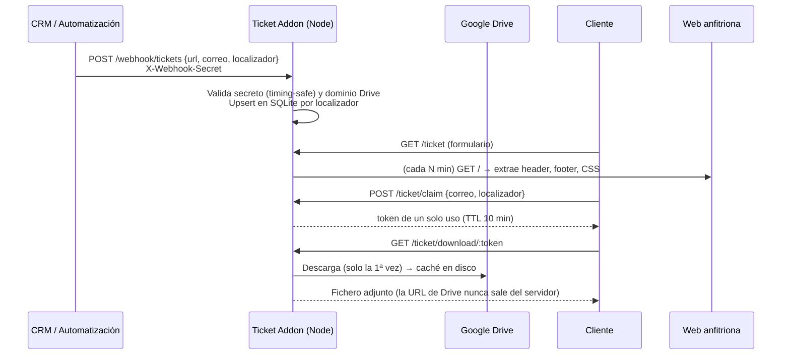

# Ticket Delivery Addon

Microservicio en **Node.js** que entrega las entradas a los clientes de un e-commerce de turismo sin exponer nunca la URL de origen del fichero. Se instala junto a cualquier web (WordPress, Next.js…) **sin tocar su código ni su base de datos**. Además clona en tiempo real el header y el footer de la web anfitriona, de modo que la página de descarga parece una página más del sitio.

> Desarrollado en producción para varias webs de venta de entradas a monumentos. Esta versión pública está saneada, sin marcas, IDs ni datos reales.

  

## El problema

Las entradas de cada reserva se generaban como PDF en Google Drive y se enviaban al cliente con el enlace directo de Drive. Esto tenía varios problemas:

- El enlace de Drive quedaba expuesto: se podía reenviar y daba pistas de la estructura interna.
- Si una entrada se regeneraba, el cliente seguía teniendo el enlace antiguo.
- No había un sitio donde el cliente pudiera **recuperar** sus entradas por su cuenta.
- Cada web tenía su propio stack, así que la solución tenía que ser **portable**.

## La solución



## Características

| Área | Detalle |
|---|---|
| **Seguridad** | Webhook protegido con secreto comparado con `crypto.timingSafeEqual`. Lista blanca de dominio (`https://drive.google.com`) contra SSRF. Tokens de descarga aleatorios de 192 bits, de un solo uso y con caducidad. La URL de origen se enmascara en los logs. Escucha solo en `127.0.0.1`, detrás de nginx. |
| **Integración visual** | Descarga la home de la web anfitriona, extrae `<header>`, `<footer>`, hojas de estilo y favicons, y los inyecta en sus propias páginas. Refresco periódico, y si falla mantiene la última versión válida. |
| **i18n** | 7 idiomas (es, en, it, de, fr, pt, zh). Detecta y **sustituye el selector de idioma** de la web anfitriona (WPML, Polylang, TranslatePress, GTranslate, Weglot… o por agrupación de `hreflang`) por uno propio. |
| **Rendimiento** | Caché en disco por localizador (nombre de fichero = SHA-256), escritura atómica (`.part` → `rename`) y purga automática por TTL. |
| **Idempotencia** | `localizador` es único. Si llega uno repetido se actualiza la URL y se invalida la caché, de modo que el cliente recibe siempre la última versión. |
| **Portabilidad** | Toda la configuración va por `.env`. Varias instalaciones en el mismo servidor con puertos y rutas distintos. Plantillas de systemd y nginx incluidas. |
| **Soporte (opcional)** | Si la entrada aún no está lista, muestra una página de aviso con un formulario de HubSpot embebido y el localizador prerrellenado. |

## Stack

Node.js (ESM) · Express · better-sqlite3 (WAL) · `node:test` · nginx · systemd

## Inicio rápido

```bash
npm install
cp .env.example .env      # define TOKEN_SECRET y TARGET_ORIGIN/TARGET_HOST
npm start                 # escucha en 127.0.0.1:3010
npm test                  # tests de integración con una web anfitriona simulada
```

Dar de alta un ticket:

```bash
curl -X POST http://127.0.0.1:3010/webhook/tickets \
  -H 'Content-Type: application/json' \
  -H 'X-Webhook-Secret: <TOKEN_SECRET>' \
  -d '{"url":"https://drive.google.com/uc?id=XXXX","correo":"cliente@example.com","localizador":"ABC-123"}'
```

La guía completa de despliegue (systemd, nginx, varias instalaciones, mantenimiento) está en **[INSTALL.md](INSTALL.md)**.

## API

| Método | Ruta | Descripción |
|---|---|---|
| `POST` | `/webhook/tickets` | Alta o actualización de un ticket. Requiere `X-Webhook-Secret`. Responde `201` (creado), `200` (actualizado), `400` o `401`. |
| `GET` | `/ticket` | Formulario de recuperación (correo + localizador). |
| `POST` | `/ticket/claim` | Valida correo + localizador y devuelve un token de descarga de un solo uso. |
| `GET` | `/ticket/download/:token` | Sirve el fichero. `410` si el token ha caducado o ya se ha usado. |
| `GET` | `/ticket/:localizador` | Enlace directo para el email de confirmación. |
| `GET` | `/ticket/health` | Estado del servicio y del último refresco del header/footer. |

## Estructura

```
server.js            Rutas, render de páginas y tokens de descarga
lib/db.js            Persistencia SQLite
lib/drive.js         Descarga desde Drive (incluida la confirmación de ficheros grandes)
lib/cache.js         Caché en disco con TTL
lib/chrome.js        Clonado del header/footer de la web anfitriona
lib/langSwitcher.js  Detección y sustitución del selector de idioma
lib/i18n.js          Traducciones
deploy/              Plantillas de systemd y nginx
test/                Tests de integración
```

## Decisiones de diseño

- **SQLite en lugar de reutilizar la BD de la web**: el addon no depende de WordPress ni de MySQL, así que se puede mover entre webs copiando una carpeta.
- **Tokens en memoria**: duran pocos minutos, y si el proceso se reinicia el cliente solo tiene que volver a pulsar. No compensa añadir Redis.
- **Clonado del header/footer en vez de un tema propio**: cualquier cambio de diseño de la web aparece solo en la página de descarga, sin mantenimiento.
- **Compromiso conocido**: el enlace directo `/ticket/:localizador` no pide correo, para que funcione con un clic desde el email de confirmación. Para un control más estricto, la siguiente iteración sería firmarlo con HMAC y caducidad.

## Licencia

[MIT](LICENSE)
